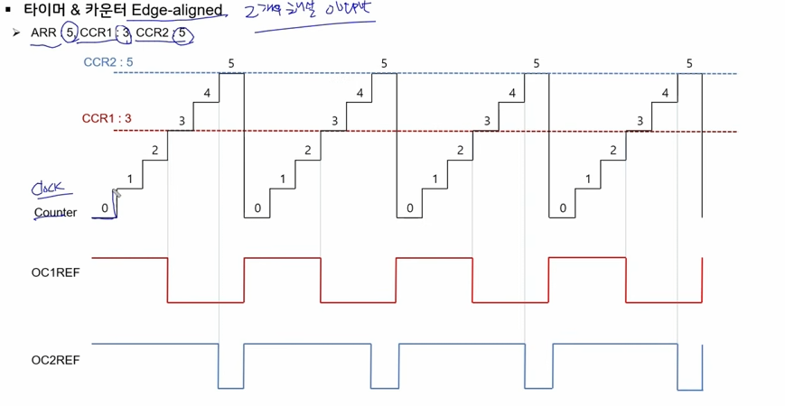

# ConveyorBelt_Project
컨베이어벨트 위로 움직이는 물체를 분류하여 로봇팔로 처리하는 팀프로젝트 

## 개발환경

- 개발 환경 (Development Environment)

    - IDE: STM32CubeIDE

    - Configuration Tool: STM32CubeMX

    - Language: C / C++

    - OS (Raspberry Pi): Ubuntu / Raspberry Pi OS

## **STM32CubeMX학습**

### MCU
- CPU에 디지털 신호,PWM,통신과 같이 임베디드 시스템에서 많이 사용되는 주변장치를 연결하여 하나의 칩으로 제작된 형태
- Cortex - A,R,M으로 나뉘는데 A쪽이 높은 성능
    - A, 스마트폰,태블릿,PC,고성능 임베디드 프로세서
    - R, 실시간 프로세싱 고성능 임베디드 프로세서, 의료기기,항공우주, 자동차 등
    - M, 초저전력,실시간 처리,범용적 사용
- stm32 f446re는 M4의 기능

### 인터럽트
- Polling 방식
    - 무언가 행동을 할 때 다른 행동은 대기

- Interrupt 방식
    - interrupt handler를 통해 행동을 진행하고 있다가 다른 행동도 가능
- NVIC(Nested Vectored Interrupt Controller)
    - M시리즈를 사용하는 경우 APM에서 개발한 NVIC라는 인터럽트 컨트롤러를 공통적으로 사용

- 처리방법 
    - 인터럽트 호출할 함수인 ISR(Interrupt Service Routine)를 정의
    - 우선순위 저장
    - 우선순위에 따라 ISR 수행
### 타이머&카운터
- ARR(Auto ReLoad Register) : 최대 카운트 값 
- CCR(Compare Capture Register) : 카운트 값을 설정
- 
- 오버플로우가 될때마다 발생하는 원리

## 동직 시나리오 요약
- 대기 상태: 모터(로봇 팔)는 90도를 유지하며 대기.

- 트리거 (Rx): 라즈베리파이에서 CAN 통신으로 '불량품 감지' 메시지 수신.

- 픽업: 모터가 0도로 이동하여 물건을 집음 (Gripper 작동).

- 이동: 모터가 180도로 이동하여 반대쪽 컨베이어 벨트 위에 물건을 놓음.

- 명령 (Tx): STM32가 반대쪽 벨트로 CAN 통신을 보내 벨트를 가동시킴.

- 복귀: 모터가 다시 90도로 돌아와 다음 명령 대기.

### 세마포어 VS 큐
- 세마포어는 전달 내용이 없는 신호만 전달 => 메모리 소모가 적고 처리 속도가 빠름
- 메시지 큐는 실제 데이터를 전달
    - 이번 프로젝트의 경우는 그냥 불량감지만 하면 로봇팔은 넘기는 동작만 하면 되기에 세마포어가 적절
    - 만약, 불량감지를 무거움,가벼움 등 구분지어야 한다면 메시지큐를 사용해야함
